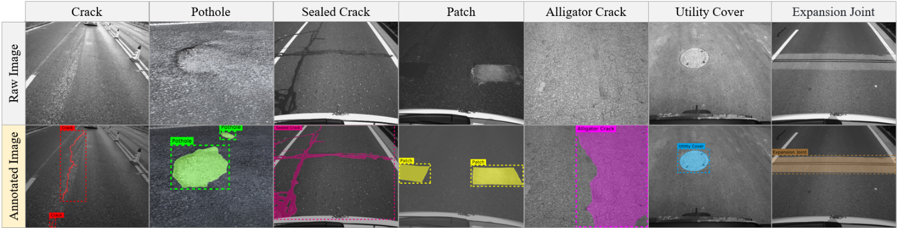

# MTPDSD: Multi-Type Pavement Distress Segmentation Dataset

## Introduction

MTPDSD is a comprehensive dataset consisting of 2,600 high-quality pavement distress images, labeled with instance segmentation fashion. The dataset includes 7 distinct categories of pavement distresses, namely crack, pothole, sealed crack, patch, alligator crack, utility cover, and expansion joint. The dataset comprises a total of 3,596 instances of pavement distress samples, with each instance labeled with a mask that accurately fits the boundary of the distress. The figure below illustrates a series of examples for all 7 categories of pavement objects.

## Data collection

We developed a vehicle-mounted pavement distress data collection system that captures wide-angle images through a dashboard camera and high-resolution images through a rear-view camera. This system enables the acquisition of high-quality images from multiple angles, resulting in a comprehensive dataset.

## Related research

> Enhancing automated health monitoring of road infrastructure through a hierarchical robust deep learning approach

## Acquisition

We are currently in the process of further organizing the data and it will be made available soon.
